# Resume Reviewer


## Overview

Resume Reviewer is a full-stack AI resume analysis and ATS simulation platform. A user uploads a PDF resume, optionally adds a job description, selects an OpenAI model, and supplies their own OpenAI API key.

The application combines:

- Progressively streamed AI resume feedback
- Deterministic ATS keyword and header scoring
- Spelling and grammar analysis
- Job-role recommendations
- GPT-5 web search for matching South African job listings

The application is stateless. It does not provide user accounts, save resumes, or persist OpenAI API keys.

## Key Features

- PDF resume upload and in-browser PDF.js preview
- Optional job-description comparison
- Server-Sent Events for progressive review results
- Structured AI output for reliable frontend rendering
- Deterministic keyword scoring with tier weights and contextual evidence
- Standard resume-header validation
- Keyword-stuffing protection for uncontextualised keyword mentions
- Dedicated job-search profile generation
- Current job discovery through GPT-5 with web search
- User-supplied OpenAI API keys held in browser memory only
- API versioning, health checks, rate limiting, and request-size limits
- Separate production containers for the web and API services
- Automated Azure Container Apps deployment through GitHub Actions

# User Interface
### Onboarding Screens

| Landing | Upload form |
|--------|--------|
| 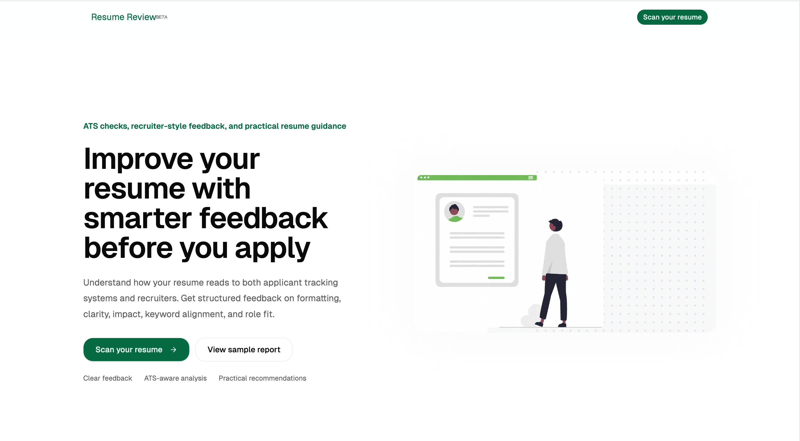 | 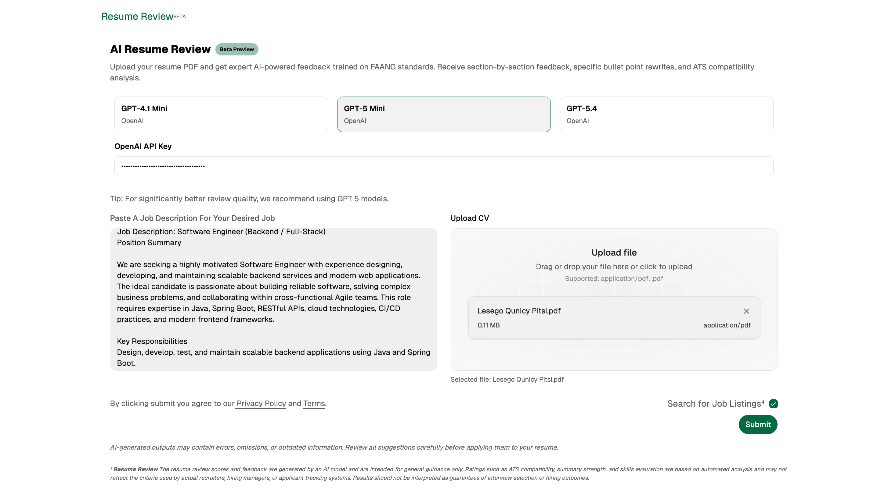 |


| Review Feedback | Review Feedback |
|--------|--------|
| 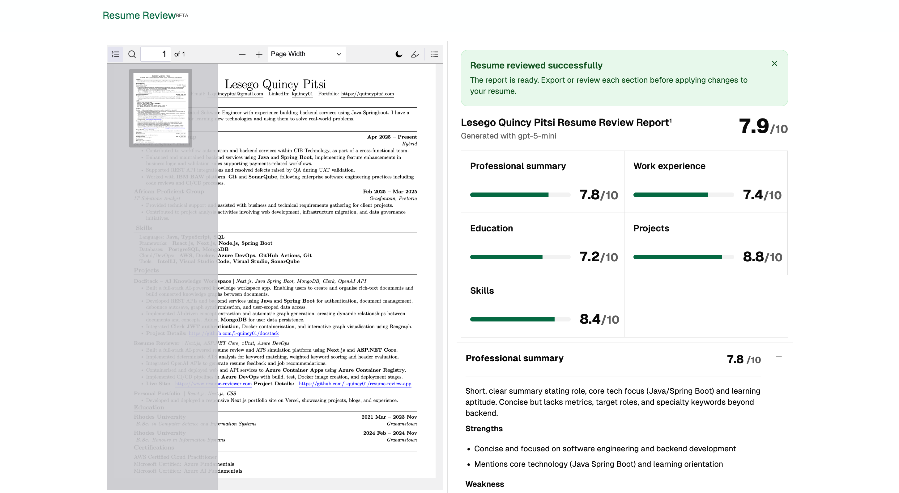 | 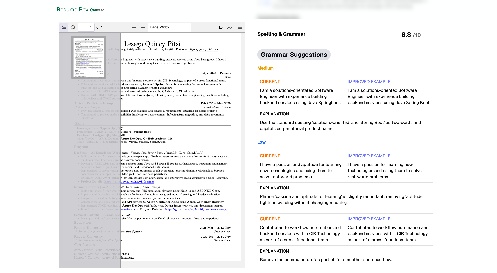 |

| Keyword Score | Keyword Score|
|--------|--------|
| 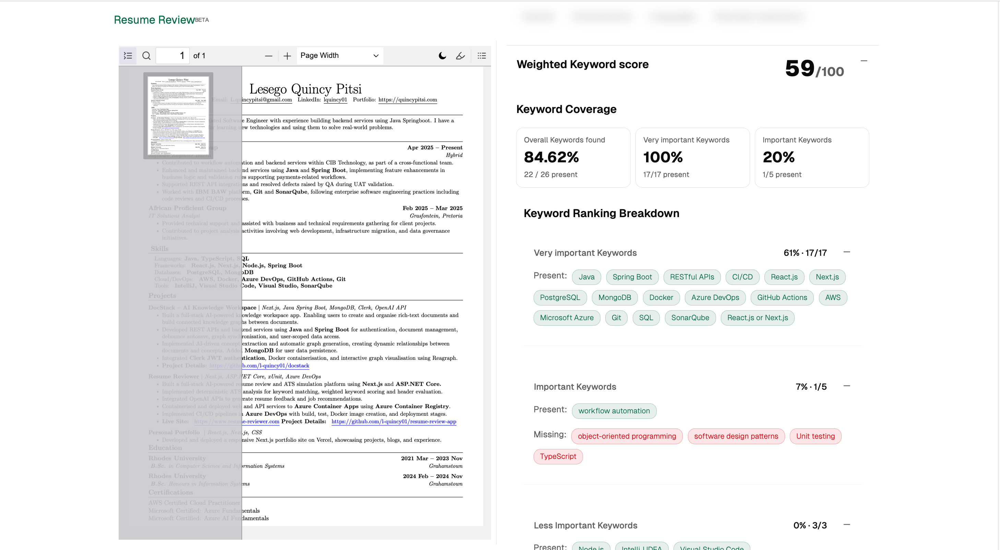 | 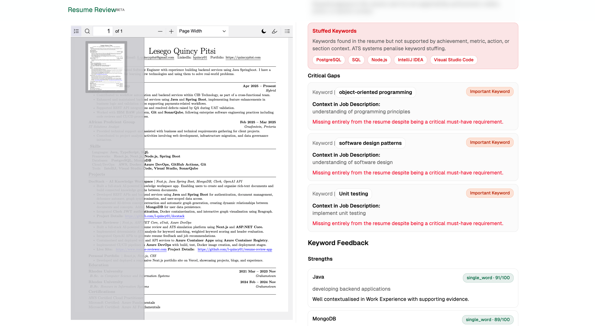 |

| Job Recommendation | Job Recommendation  |
|--------|--------|
| 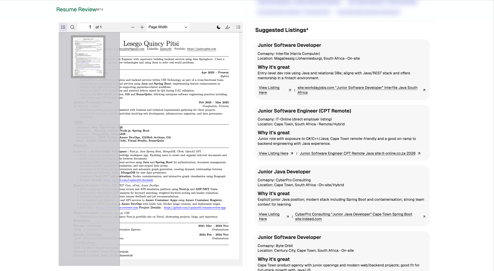 | 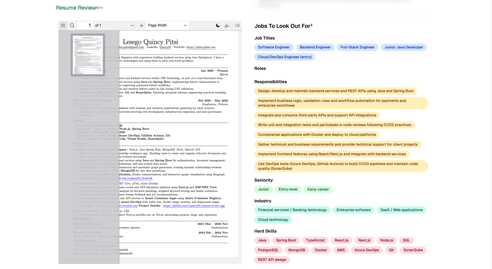 |

## Architecture

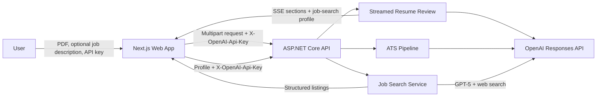

The system has two independently deployable applications:

- `apps/web`: Next.js frontend on port `3000`
- `apps/api`: ASP.NET Core API on port `5053`

There is no database in the current architecture. Resume files, API keys, job descriptions, and analysis results are processed transiently.

## End-to-End Review Flow

1. The user enters an OpenAI API key, selects a model, and uploads a PDF resume.
2. The frontend validates the required input and displays the PDF locally.
3. The streamed resume-review request and ATS pipeline start independently.
4. The backend validates request sizes, rate limits, CORS, and the user API key.
5. Resume-review sections are generated as structured OpenAI responses.
6. Completed sections are returned to the browser through Server-Sent Events.
7. The ATS pipeline extracts job-description keywords, analyses resume context, and calculates deterministic scores.
8. If job search is enabled, the streamed candidate profile is sent to the dedicated job-listings endpoint.
9. GPT-5 searches the web for current matching South African jobs.
10. The frontend renders feedback, ATS results, recommendations, and job listings.

### Resume Review Sequence

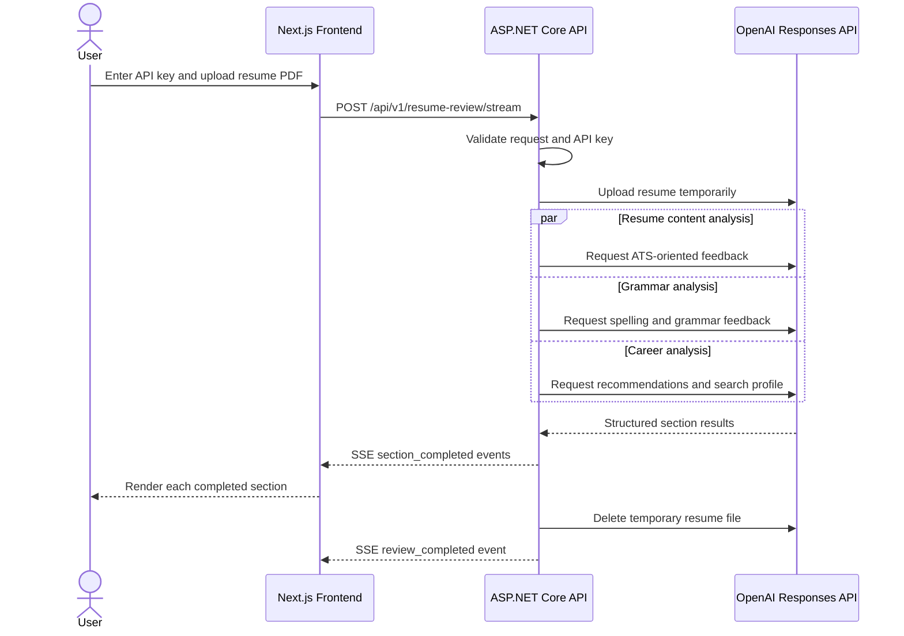


## ATS Scoring Pipeline

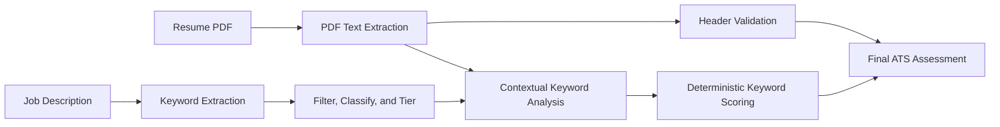

AI assists with keyword extraction and contextual evidence classification. The numerical score is calculated by application code.

Keywords are grouped into Tiers 0-3. Higher-priority and repeated job-description keywords receive greater weight. Each keyword is scored using:

- Tier baseline points
- Achievement context
- Metrics
- Action verbs
- Work-experience, project, and summary placement
- Must-have or nice-to-have multipliers

Missing keywords receive zero. A keyword that is present without supporting context also receives zero as a keyword-stuffing safeguard.

The final assessment is calculated as:

```text
ATS readiness = (overall keyword score * 70%) + (header quality score * 30%)
```

### ATS Scoring Sequence

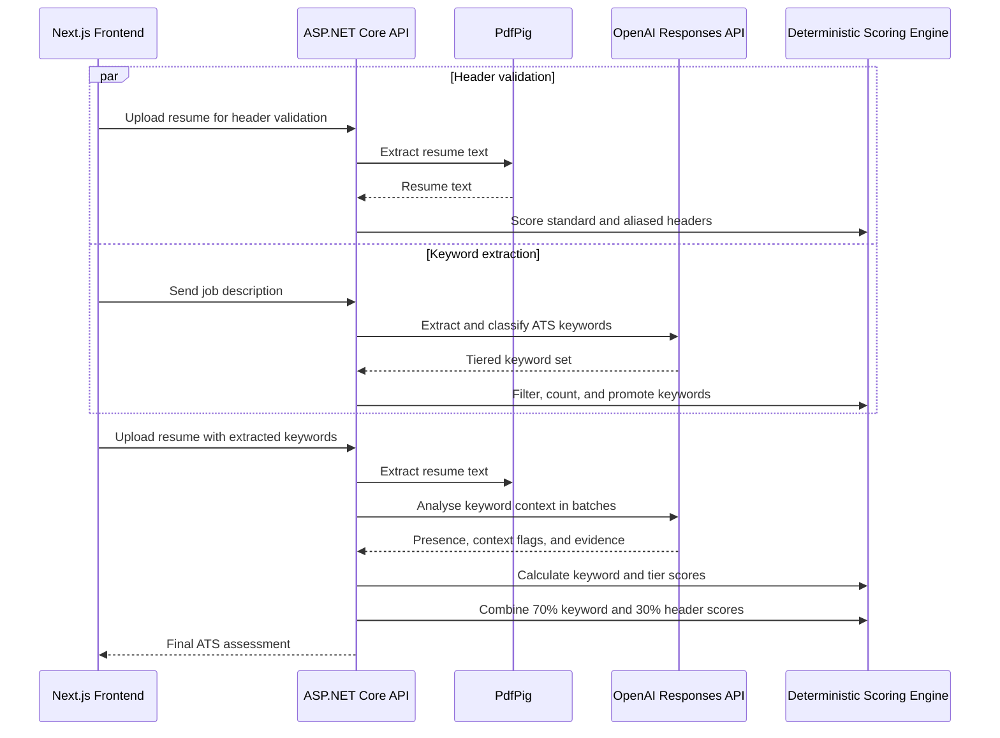

## Job Search Flow

The resume-review pipeline generates a focused profile containing:

- Target job titles
- Technical keywords
- Seniority
- South African and remote locations
- Roles or levels to exclude

The frontend waits until job search is enabled and this profile exists. A review run ID and stable request key prevent duplicate searches, while stale requests are aborted or ignored.

The backend passes the profile unchanged to GPT-5 with the OpenAI `web_search` tool enabled. Provider failures return an error instead of being represented as a successful empty result.

### Job Search Sequence

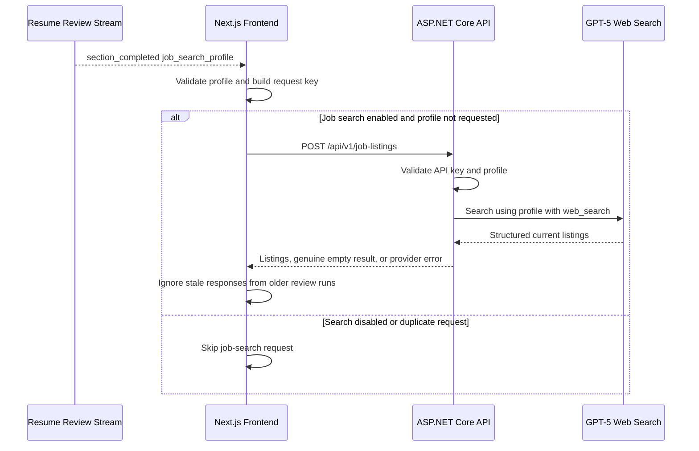

## OpenAI API Key Security

Resume Reviewer uses a bring-your-own-key model:

- The key is entered through a masked field.
- It is kept in an in-memory Zustand store.
- It is sent to the API as `X-OpenAI-Api-Key`.
- The backend applies it only to the current outbound OpenAI request.
- It is not placed in JSON bodies, form data, URLs, cookies, local storage, or session storage.
- The sensitive header is redacted before application request logging.

Production deployments must use HTTPS. The user's own browser can display the outgoing header in developer tools because the browser must send it, but the application does not intentionally persist it.

### API Key Request Flow

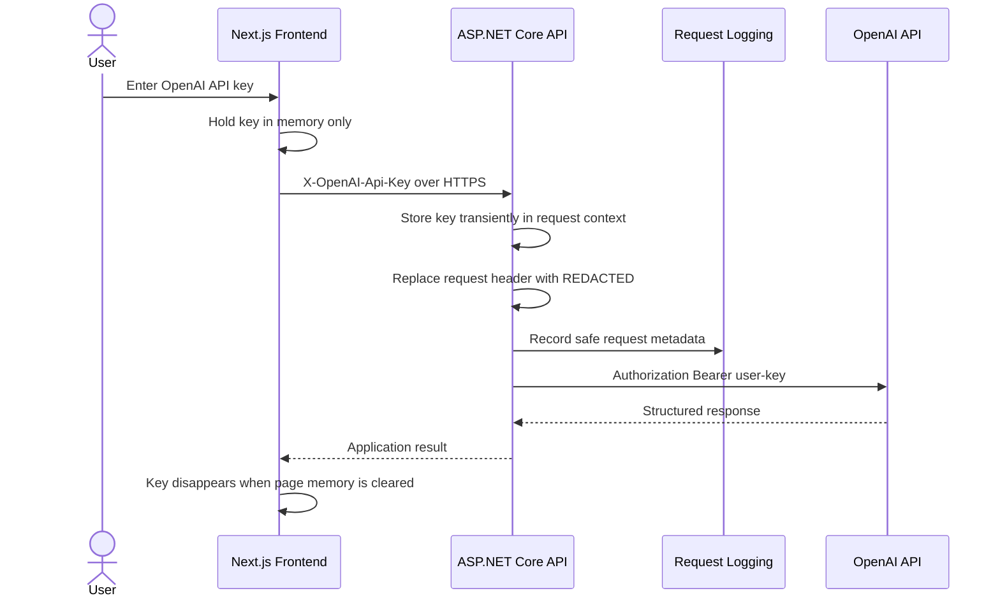

The application does not implement user accounts or session authentication. The user API key authorises only the outbound OpenAI operation for the current request.


## Tech Stack

| Layer | Technology |
|---|---|
| Frontend | Next.js 16, React 19, TypeScript |
| State | Zustand |
| Styling | Tailwind CSS, Radix UI, shadcn |
| PDF viewer | PDF.js |
| Backend | ASP.NET Core 9, C# |
| PDF extraction | PdfPig |
| AI | OpenAI Responses API and structured outputs |
| Logging | Serilog |
| Frontend tests | Playwright |
| API tests | xUnit |
| Containers | Docker, Docker Compose |
| Cloud | Azure Container Apps, Azure Container Registry |
| Infrastructure | Bicep |
| CI/CD | GitHub Actions |
| DNS | Cloudflare |

## Project Structure

```text
.
├── apps
│   ├── api
│   │   ├── Controllers
│   │   ├── Dtos
│   │   ├── Services
│   │   ├── Options
│   │   └── Dockerfile
│   ├── api.Tests
│   └── web
│       ├── app
│       ├── components
│       ├── service
│       ├── stores
│       ├── tests
│       └── Dockerfile
├── infra
│   └── azure-container-apps
├── packages
│   ├── eslint-config
│   ├── typescript-config
│   └── ui
├── scripts
│   └── security
├── docker-compose.yml
├── docker-compose.dev.yml
└── resume-tracker.sln
```


